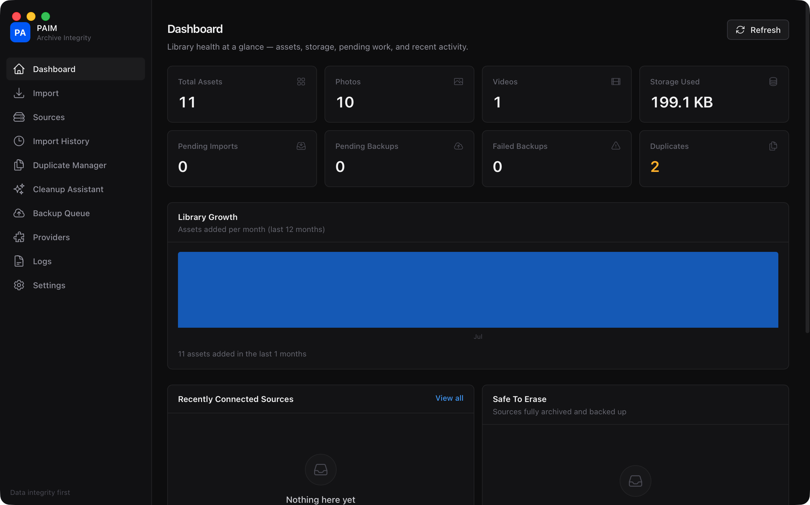
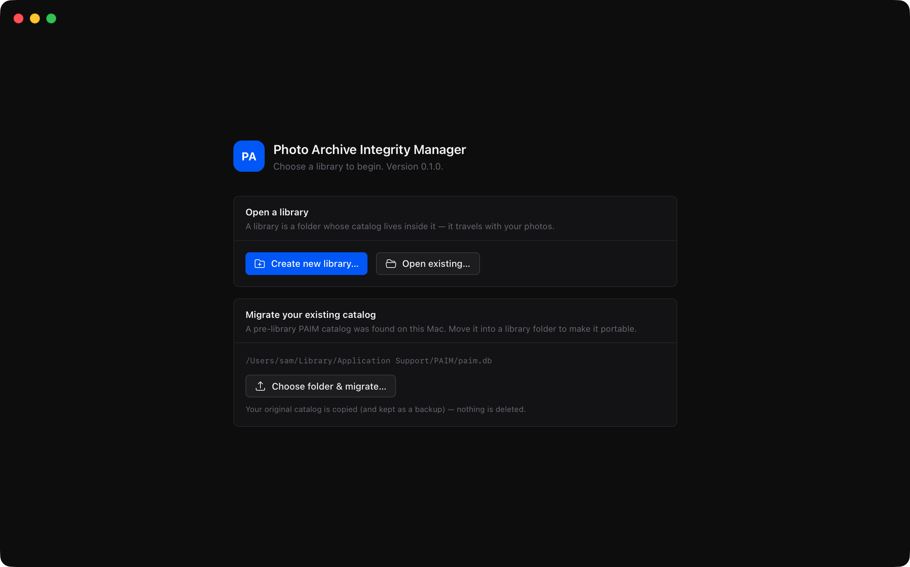
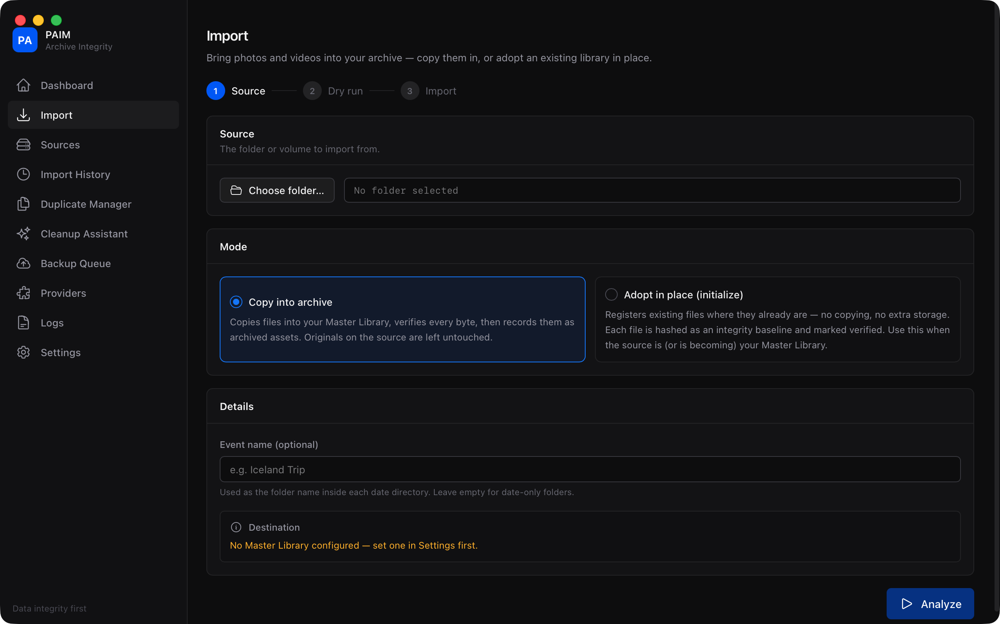
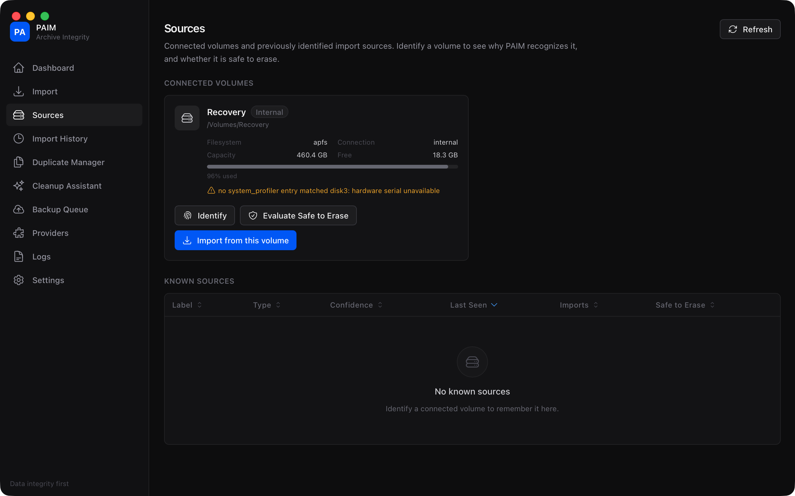
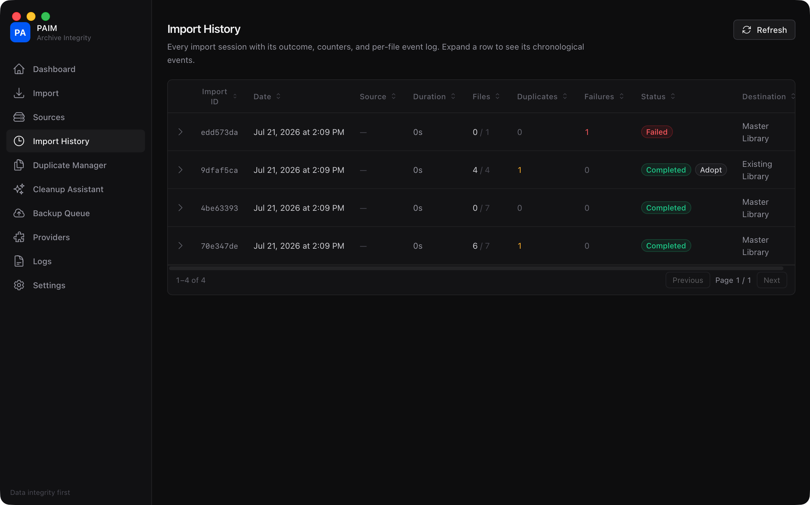
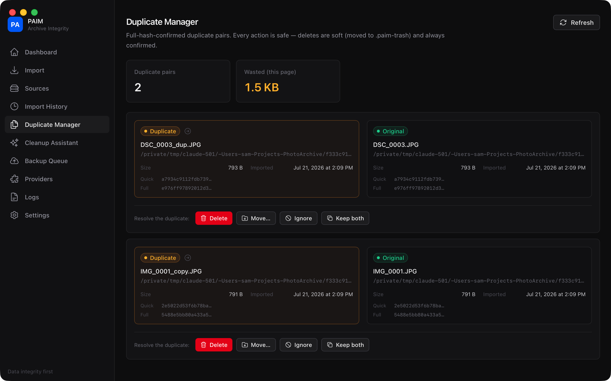
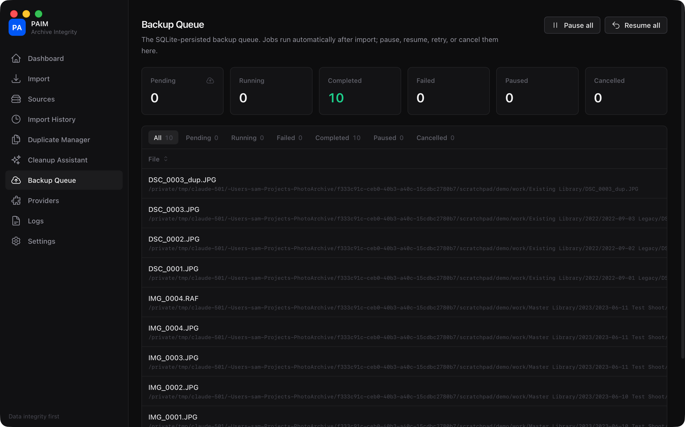

# PAIM — Photo Archive Integrity Manager

A macOS desktop app for **importing, verifying, backing up, and safely reclaiming photo
storage**. PAIM is not a photo editor or a Lightroom-style DAM — its single responsibility
is making sure your photos and videos get into a master archive *provably intact*, stay
tracked forever in a local SQLite database, get backed up, and that cards, drives, and
stray folders can be erased with confidence instead of anxiety.

Built with Go and Wails v3 (React + TypeScript frontend). No Electron. No cloud account.
Your catalog is a SQLite file that lives inside your library folder and travels with it.



## The promise

**PAIM never risks data loss, and every operation is restart-safe.**

Every imported file goes through one protocol:

```
BLAKE3 quick-hash → duplicate check → copy to .paim-partial → fsync file + dir
    → re-hash the destination → exclusive atomic publish → record in one transaction
```

- Nothing is marked imported before the destination bytes are verified **and** durable.
- Asset identity is content hashes only — never filenames, timestamps, or EXIF.
- Deletes anywhere in the system are renames into `.paim-trash`; database rows are
  soft-deleted, never removed.
- A crash, power loss, or yanked drive mid-import resumes exactly where it left off,
  with no duplicated imports and no duplicated backups.

## Features

- **Import** — recursive scan, a read-only dry run that predicts exact counts (files,
  photos, videos, already imported, duplicates, size, time), then a live-progress import.
- **Adopt in place (initialize)** — for a library that already lives on the drive that
  will become the archive: registers files where they sit with a full BLAKE3 integrity
  baseline, copying nothing. Optional reorganization into the archive layout uses
  same-volume atomic renames only — it will refuse a cross-volume move rather than
  silently degrade to copy+delete.
- **Two-stage duplicate detection** — BLAKE3 quick hash (size + first/last 4 MiB) as a
  cheap filter; only a full-content hash match ever declares a duplicate.
- **Source intelligence** — volumes are identified by hardware serials, filesystem UUIDs,
  and a content fingerprint, never by volume label (`UNTITLED` means nothing). Every
  identification carries a 0–100 confidence score and a human-readable list of *why*.
- **Safe to erase** — a source is only called erasable when every media file on it maps to
  a verified archived asset whose required backups are complete. Otherwise you get the
  exact counts of what's blocking it.
- **Cleanup Assistant** — point it at any folder (Desktop, Downloads, an old drive); it
  performs a strictly read-only analysis and classifies every file as archived, duplicate,
  new, or unknown, then applies the same safe-delete rules before recommending anything.
- **Asynchronous backups** — a worker pool over a SQLite-persisted queue with
  pause/resume/retry/cancel and exponential backoff. Backup destinations are plugins;
  a local-filesystem plugin ships today, and the interface is ready for cloud providers.
- **Live Photos** — HEIC+MOV pairs are detected (basename + Apple ContentIdentifier) and
  linked as one logical asset through import, verification, and backup.
- **Full provenance** — every asset answers: where did it come from, when, from which
  source and session, where is it now, is it verified, is it backed up, what duplicates it.
- **Everything logged** — every copy, hash, verification, duplicate decision, backup, and
  failure lands in a searchable, exportable log.

## Screenshots

| | |
|---|---|
|  |  |
| Welcome — open, create, or migrate a library | Import — copy mode or adopt-in-place, with dry run |
|  |  |
| Sources — volume identification with reasons | Import History — every session, expandable events |
|  |  |
| Duplicate Manager — hash-confirmed pairs, safe actions | Backup Queue — live progress, retries, pause/resume |

More in [`docs/screenshots/`](docs/screenshots/): Cleanup Assistant, Providers, Logs, Settings.

## Archive layout

Default (configurable):

```
Master Library/
  2026/
    2026-07-17 Yosemite/
      DSCF0001.JPG
      Video001.MOV
      RAW/
        DSCF0001.RAF
```

JPEGs sit beside videos; RAW files go in a `RAW/` subfolder. Dates come from capture
metadata (exiftool), falling back to file modification time.

## Stack

| Layer | Choice |
|---|---|
| Backend | Go 1.24+, GORM + SQLite (WAL, foreign keys, soft deletes) |
| Hashing | BLAKE3 (`lukechampine.com/blake3`) |
| Metadata | exiftool in `-stay_open` batch mode (graceful degradation if absent) |
| Volumes | `diskutil` / `system_profiler` probing + fsnotify mount watching |
| Frontend | Wails v3, React, TypeScript, Tailwind CSS v4, TanStack Router + Table, Heroicons |

## Building and running

Prerequisites: Go 1.24+, Node 20+, the Wails v3 CLI, and (recommended) exiftool:

```sh
brew install go exiftool
go install github.com/wailsapp/wails/v3/cmd/wails3@latest
```

Then:

```sh
wails3 build        # production build → bin/PAIM
wails3 dev          # development mode with hot reload
go test ./...       # backend test suite
```

The database lives at `~/Library/Application Support/PAIM/paim.db`
(override with the `PAIM_DB_PATH` environment variable).

First run: open **Settings** and set your Master Library root, add a backup destination
under **Providers**, then use **Import** — choose *Copy into archive* for cards and
drives, or *Adopt in place* to initialize from an existing library without copying.

## Project layout

```
main.go                  # composition root: wiring, services, startup recovery
internal/
  domain/                # models and enums
  db/, repo/             # SQLite (WAL) + repositories
  hashing/               # BLAKE3 quick/full hashing and copy verification
  mediatype/, metadata/  # media registry, Live Photo pairing, exiftool wrapper
  source/, volumes/      # source identification, confidence model, volume watching
  archive/, importer/    # layout resolution, import pipeline (copy + adopt modes)
  backup/                # queue, worker pool, plugin interface, localfs plugin
  cleanup/               # read-only folder analysis + safe-delete rules
  services/              # Wails-bound service layer (DTOs, events)
frontend/                # React + TypeScript UI (ten pages, dark mode)
docs/ARCHITECTURE.md     # the full architecture specification
```

## Status

Working: the full import/verify/adopt pipeline, duplicate management, source
identification, backup queue with the local-filesystem plugin, cleanup analysis, and all
ten UI pages. Wails v3 is still in alpha (pinned at `alpha2.117`). Cloud backup providers
(S3, Backblaze, Google Drive, …) are future plugins on the existing interface.

## License

Private project — no license granted.
